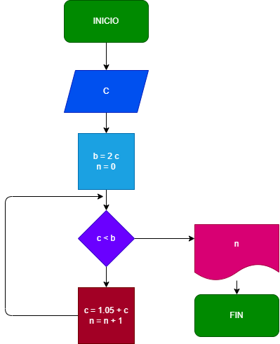

### Ejercicio N° 2

### Hacer el diagrama de flujo y el programa en python, que lea un capital c, y que averigue e imprima en cuantos meses se duplica, si lo colocamos a un interes compuesto del 5% mensual

## DIAGRAMA DE FLUJO
